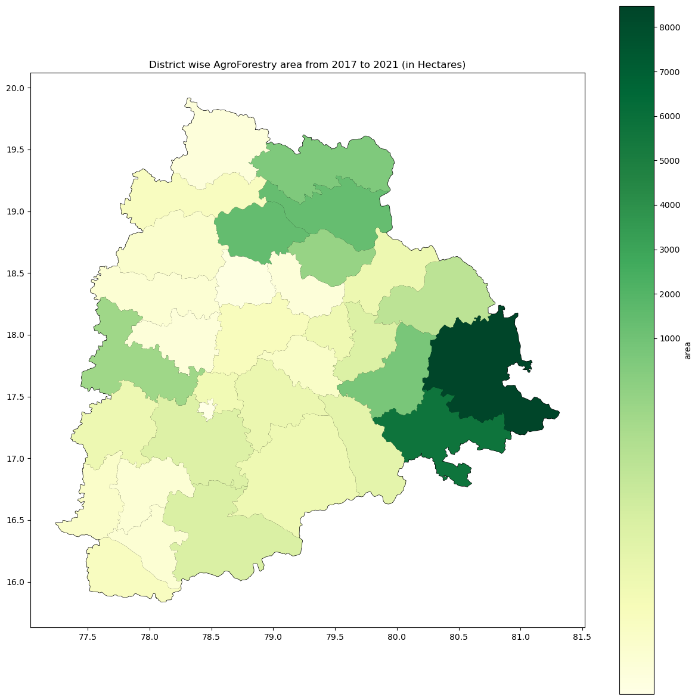
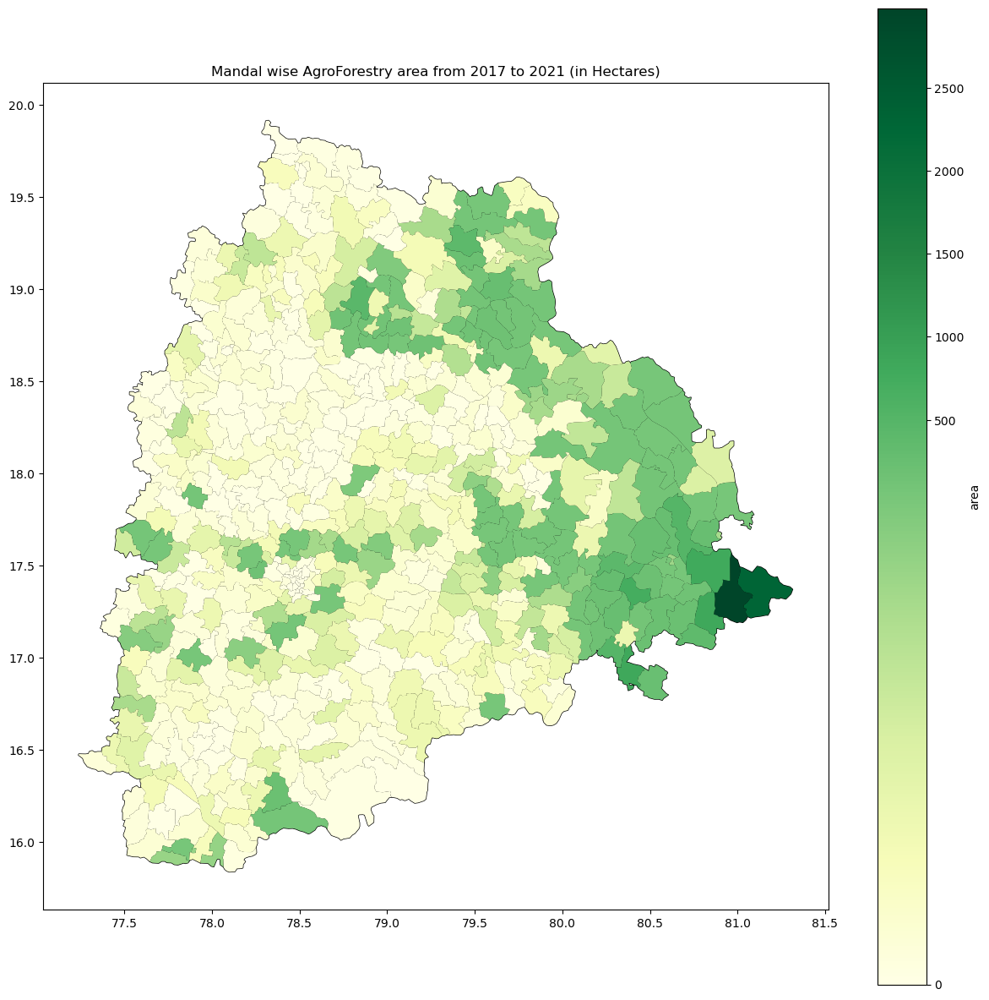
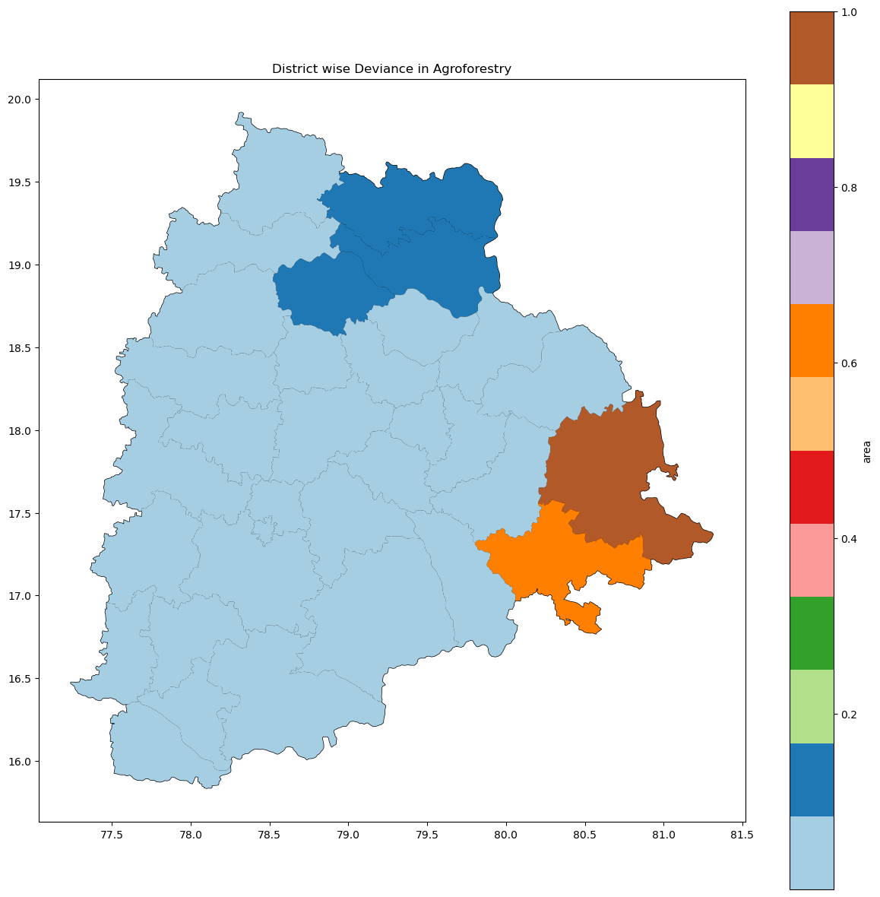

# AgroForestry Analysis in Telangana State

AgroForestry is interaction of agriculture and trees, including the agricultural use of trees. It has potential for reducing the poverty, enhancing the livelihood, improving the food security and mitigating the climate change. Farmers in Telangana now can grow more varieties of trees under Agroforestry, including the common man’s timber, bamboo, in non forest areas, cut and sell them in the market without seeking permission from the Forest Department.  

### AgroForestry Area Calculation

Take base year ( like 2017) in a particular boundary (like mandal or district)  
Take LULC data of base year and latest availability year data ( 2017-2021)  
Filter out pixels other than crop class from base year LULC data and then put filter for tree cover class in latest year LULC data  
Calculate area from resultant number of pixels after putting both filter 
Repeat process for every boundary  

### Results

 
  

### DPPD Analysis

2017 has been taken as base year  
Crop to Tree cover converted has been created for 2018 to 2021 with respect to base year 
Changes has been analyzed annually for agroforestry area from 2017 to 2021 
DPPD has been calculated, district and mandal wise  

### DPPD Results and Discussion

 
![Mandal wise Agroforestry DPPD Analysis]](agro_dev_5yr_mandal.png)  

